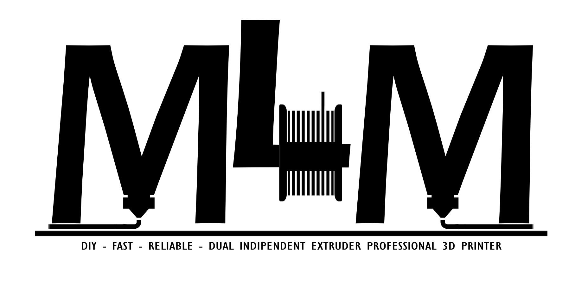

# MLM-IDEX 
MLM IDEX is a mod for Ben Levi's BLV MGN CUBE Project
 
 
 
 

## English 
BLV MLM IDEX is a italian project started in August 2020 in collaboration with Maicol Spazzini (MASP-Solutions), Loris Granatella and Mario Salerno.  
We redesigned Ben Levi's BLV MGN Cube and created an IDEX version.  
This printer allows you to create copy, mirror and IDEX configuration prints (using two different colours or materials). 
The MLM IDEX is equipped with MASP Hotend MK8-R All Metal with adjustable titanium throat, Duet 2 Wi-Fi, Duex5. 
The X and U axes are driven by powerful LDO Motors 0.9° 1.4A pancakes that allow 800/step rotations. 
The same ones are also used for E0 and E1, combined with a specially designed dual drive system. 
The Y-axis is driven by two Wantai 0.9° 2.4A motors working in pairs: the advantage is the possibility to move the x/u bridge at high speeds and without uncertainties, also thanks to the use of a robust 9mm reinforced GT2 belt (Gates Powergrip). 
Regarding the X- and U-axes, 6mm GT2 (Gates Powergrip) belts were used to reduce space requirements and to have less moving mass than the Y-axis. 
A cleaning system tied to the X/U bridge ensures that the inactive tool nozzle can purge outside the plate (tool parking area) and cleans the nozzle before it enters the printing area. 
The calibration of the Z offset, for "Tool 0" (i.e. X), is semi-automatic thanks to the use of a contact probe (BLTouch) and a procedure written by us ad hoc to facilitate the operation. As for the "Tool 1" (i.e. U) the calibration of the Z offset is manual, effectively facilitated by the constructive conformation of the MASP MK8-R hotend. 
It is possible to choose between two or three trapezoid screws, driven by powerful Wantai 1.8° 2.5A motors. 
The plate heater is a 600W - 220V "membrane" type, the top is made of 6mm ground aluminium. 
The project is open source, all the necessary parts are freely available for purchase and printing. 
The project provides all the files for the configuration that we have developed after months of testing. 
## [Watch the project in 3D](https://a360.co/38jP7D8) 

## Italiano 
MLM IDEX è un progetto nato ad Agosto 2020 in collaborazione con Maicol Spazzini (MASP-Solutions),  Loris Granatella e Mario Salerno, nel quale abbiamo riprogettato la BLV MGN Cube di Ben Levi creandone una versione IDEX.  
Questa stampante permette di creare stampe in copia, in mirroring e stampe in configurazione IDEX (due colori o materiali differenti). 
MLM IDEX è equipaggiata con MASP Hotend MK8-R All Metal con gola in titanio regolabile, Duet 2 Wi-Fi, Duex5. 
Gli assi X ed U sono azionati da potenti pancake LDO Motors 0,9° 1.4A che permettono di avere 800/step giro, gli stessi sono utilizzati anche per E0 ed E1, abbinati ad un sistema dual drive realizzato ad hoc. 
L'asse Y è azionato da 2 motori Wantai 0,9° 2,4A che lavorano in coppia, a vantaggio di ciò, la possibilità di muovere il ponte X/U senza incertezze e ad alte velocità, garantito anche dall'impiego di una robusta cinghia da 9mm rinforzata di tipo GT2 (Gates Powergrip).
Per quanto concerne gli assi X ed U, sono state impiegate cinghie da 6mm di tipo GT2 (Gates Powergrip) per ridurre gli ingombri e per la minor massa in movimento rispetto all'asse Y. 
Un sistema di pulizia vincolato al ponte X/U fa in modo che l'ugello del tool non attivo possa spurgare al di fuori del piatto (tool parking area) e pulisce l'ugello prima del suo ingresso nell'area di stampa.
La calibrazione dell'offset Z, per il "Tool 0" (ovvero X), è semiautomatica grazie all'impiego di una probe a contatto (BLTouch) e ad una procedura scritta da noi ad hoc per facilitare l'operazione, per quanto riguarda il "Tool 1" (ovvero U) la calibrazione dell'offset Z è manuale, agevolata efficacemente dalla conformazione costruttiva dell’hotend MASP MK8-R. 
E' possibile scegliere se movimentare l'azze z servendosi di due o tre viti trapezie, azionate da potenti Wantai 1.8° da 2.5A. 
Il riscaldamento del piatto è di tipo a "membrana" da 600W - 220V, il piano in alluminio rettificato da 6mm. 
Il progetto è open source, tutte le parti necessarie alla realizzazione del progetto sono liberamente acquistabili e stampabili. 
Il progetto mette a disposizione tutti i file per la configurazione che abbiamo messo a punto dopo mesi di collaudo. 
## [Guarda il progetto in 3d](https://a360.co/38jP7D8) 
